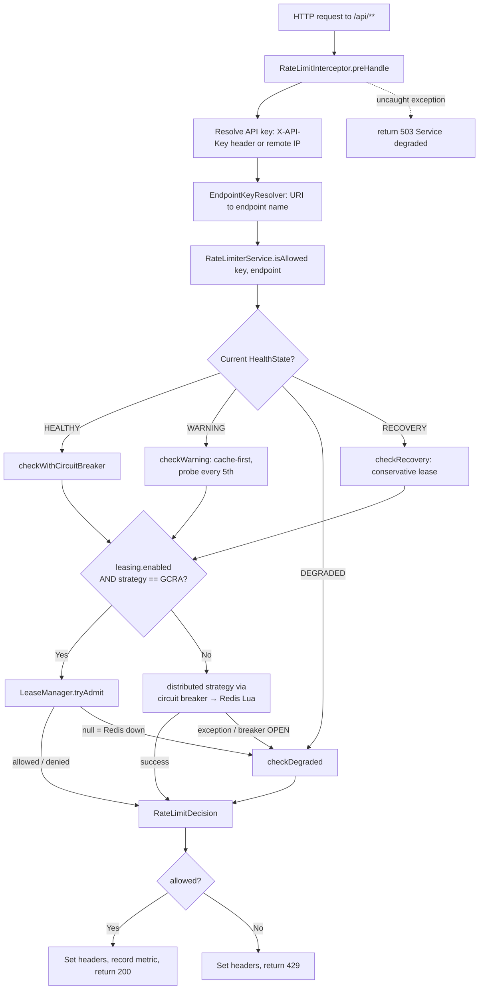
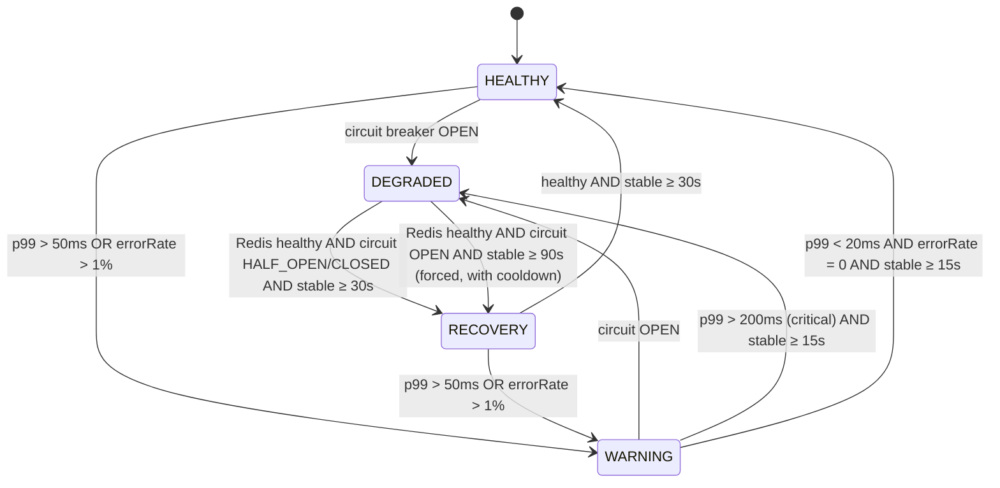
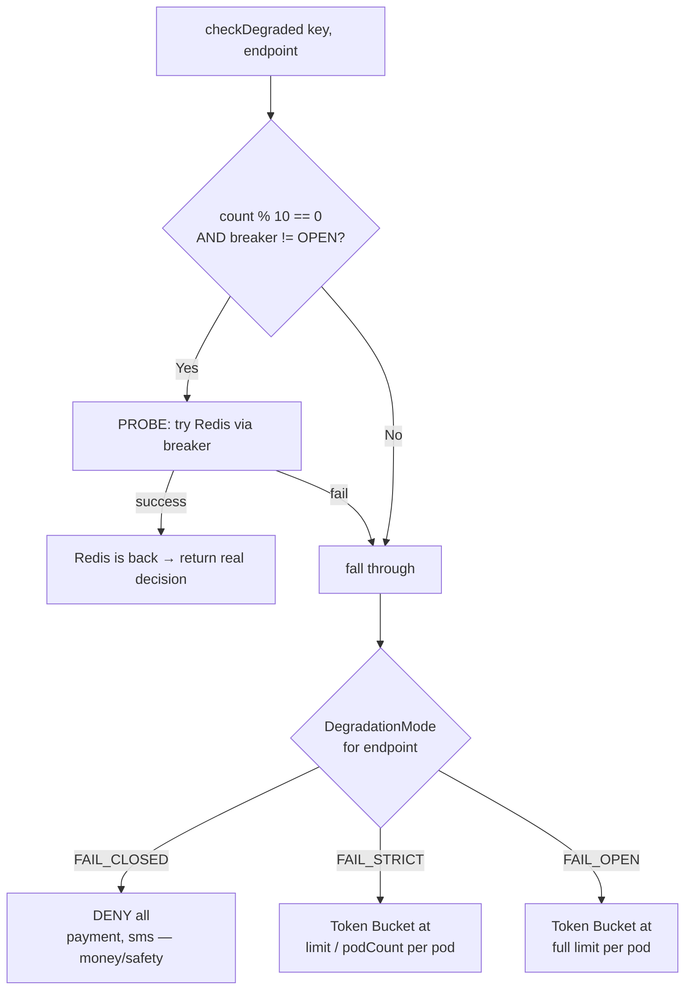
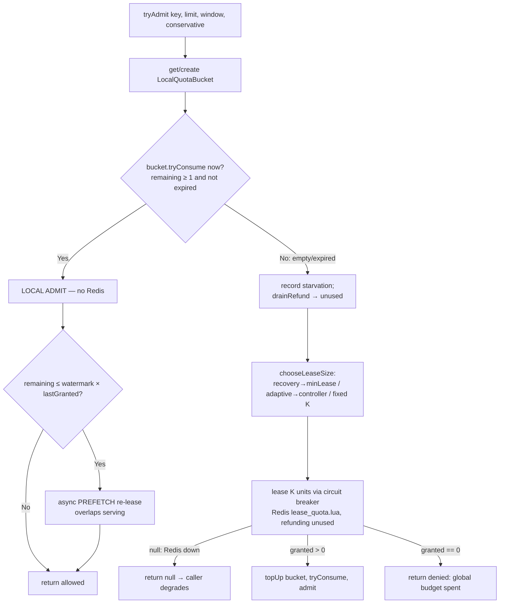
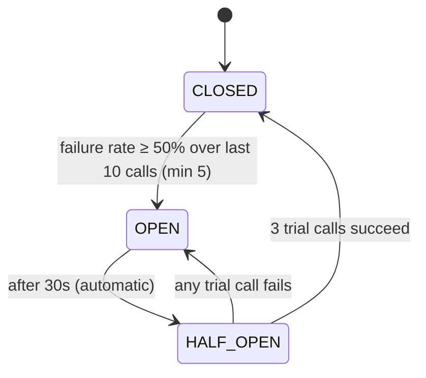
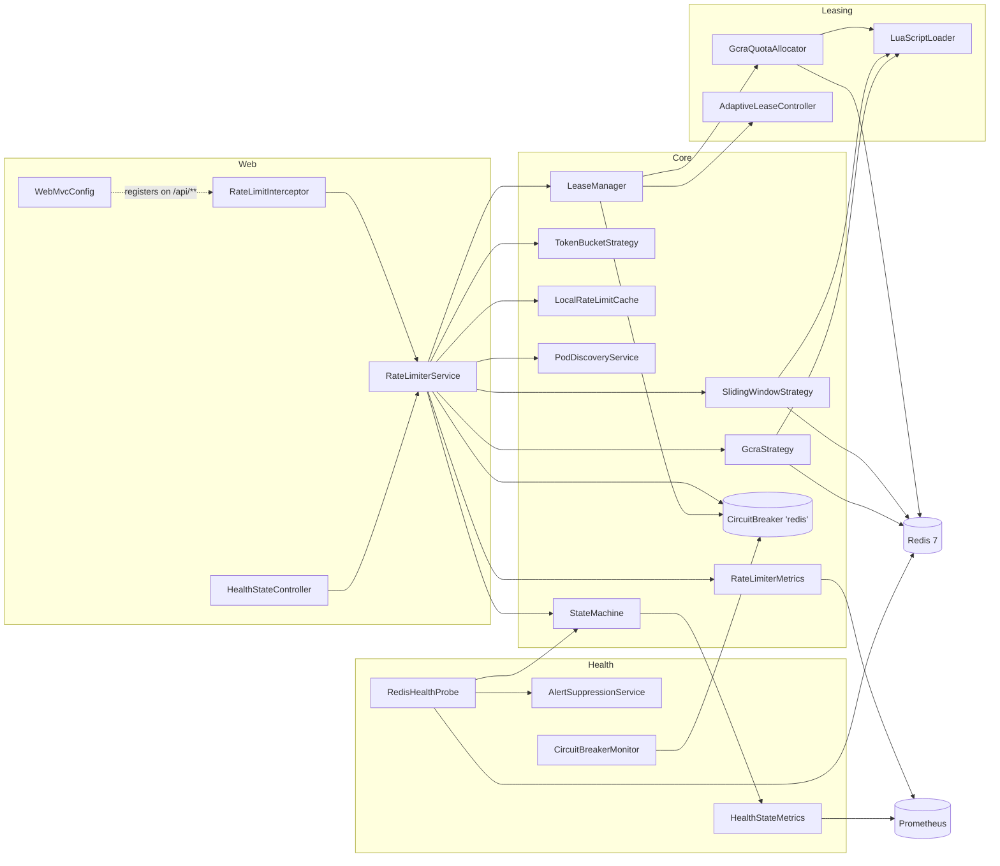

# Adaptive Distributed Rate Limiter — Project Presentation

**Algorithm & Methodology · Flowcharts · Advanced Modules · Integration · Test Cases**
_Spring Boot 4.1 · Java 21 · Redis 7 + atomic Lua · Resilience4j · Micrometer/Prometheus · 2026-08-26_

> **Note on diagrams:** every flowchart below is written in **Mermaid**. It renders live in VS Code's Markdown preview (with the *Markdown Preview Mermaid Support* extension) and on GitHub. If you paste into slides, use the rendered image or the ASCII fallback provided alongside the key ones.

---

## 0. System in one slide

> **A distributed API rate limiter that stays correct and available even when its own coordination store (Redis) slows down or dies.** It picks the *right algorithm per endpoint* (exact ceiling vs. rate pacing), watches Redis health with a 4-state machine + circuit breaker, and **degrades gracefully** to local enforcement instead of failing the request. An optional **quota-leasing** layer removes ~99% of Redis round trips on healthy traffic.

| Pillar | What it means | Where it lives |
|---|---|---|
| **Right tool per endpoint** | EXACT_QUOTA → Sliding Window; RATE/PACING → GCRA; local fallback → Token Bucket | `service/strategy/*`, config-driven |
| **Adaptive health** | 4-state machine (HEALTHY/WARNING/DEGRADED/RECOVERY) with hysteresis | `service/state/StateMachine` |
| **Never hard-fail** | Circuit breaker + 3 degradation modes (FAIL_OPEN / STRICT / CLOSED) | `RateLimiterService.checkDegraded` |
| **Cheap at scale** | Batch-GCRA quota leasing: 1 Redis call per K admits | `service/quota/*` (Phase 3) |
| **Observable** | Prometheus metrics, state gauge, alert + flap suppression | `metrics/*`, `service/state/AlertSuppressionService` |
| **Proven** | 73 automated tests (real Redis via Testcontainers), 0 failures | `src/**/…Test.java` |

**Configured endpoints (effective policy):**

| Endpoint | Limit / 60s | Strategy | Guarantee class | Degradation mode |
|---|--:|---|---|---|
| `payment` | 10 | Sliding Window | EXACT_QUOTA | FAIL_CLOSED |
| `sms` | 5 | Sliding Window | EXACT_QUOTA | FAIL_CLOSED |
| `ai-inference` | 50 | GCRA | RATE/PACING | FAIL_STRICT |
| `search` | 200 | GCRA | RATE/PACING | FAIL_OPEN |
| *(default)* | 100 | Sliding Window | — | FAIL_STRICT |

---

## 1. Algorithm / Methodology

The system is **multi-algorithm by design** — no single rate-limiting algorithm is correct for every endpoint. The core methodology is: *classify each endpoint by the guarantee it needs, then bind it to the algorithm that provides exactly that guarantee.*

### 1.1 Guarantee taxonomy (the design axiom)

| Endpoint class | Example | Guarantee needed | Algorithm |
|---|---|---|---|
| **EXACT_QUOTA** | payment, sms | Hard, auditable ceiling — *never* more than N per rolling window | **Sliding Window** |
| **RATE / PACING** | search, ai-inference | Shield a downstream from *sustained* overload; a bounded burst is fine | **GCRA** |
| **Degraded / local** | any, when Redis is down | Best-effort local cap without coordination | **Token Bucket** |

This is why the presentation is *not* "which algorithm is best" but "**which algorithm for which promise**."

### 1.2 Algorithm A — Sliding Window (exact ceiling)

**Used for:** payment, sms (EXACT_QUOTA). **Redis structure:** a **sorted set** per key (`ratelimit:<key>:window`), member = request-id, score = timestamp.

**Method (atomic Lua — `sliding_window.lua`):**
1. `ZREMRANGEBYSCORE key 0 (now − window)` — evict entries older than the window.
2. `ZCARD key` — count live requests.
3. If `count < limit` → `ZADD key now requestId`, `PEXPIRE`, allow with `remaining = limit − count − 1`.
4. Else deny; `reset = oldest_entry_score + window`.

**Property:** the count in *any* rolling W-second window can **never exceed N**. Exact, at the cost of storing one entry per request.

### 1.3 Algorithm B — GCRA (Generic Cell Rate Algorithm, rate pacing)

**Used for:** search, ai-inference (RATE/PACING). **Redis structure:** a **single number** per key — the **Theoretical Arrival Time (TAT)** (`ratelimit:<key>:gcra`). No per-request timestamps → far less memory than Sliding Window.

**Method (atomic Lua — `gcra.lua`):**

```
emission_interval = period_ms / limit      -- ideal spacing between conforming requests
dvt (burst)       = period_ms              -- delay-variation tolerance = one full window
now               = redis.call('TIME')     -- Redis' own clock: no cross-node skew
tat               = max(GET key, now)      -- drain stale debt: a fully idle key starts at "now"
new_tat           = tat + emission_interval
allow  IF  new_tat − dvt ≤ now             -- conforming?
  on allow:  SET key new_tat ;  PEXPIRE key ceil(new_tat − now)
  remaining = floor((dvt − (new_tat − now)) / emission_interval)
```

**Properties:**
- Sustains a **long-run rate of N per window**, but *tolerates a burst*: against a fully idle key, exactly `limit` requests are admitted back-to-back (DVT = one window).
- **Self-expiring**: the key's TTL is set to when the TAT decays back to "now", so idle keys evaporate → bounded Redis memory.
- Uses **Redis' `TIME`** inside the atomic script, so every app instance decides against one shared clock (no node clock-skew).

> **Why not Sliding Window everywhere?** GCRA's rolling-window count can exceed the nominal limit by design (a burst up to ~2·limit−1). That's *unacceptable* for payments (money) but *ideal* for search/inference (protect the backend, allow spikes). See `docs/GCRA-vs-Sliding-Window-Decision.md`.

### 1.4 Algorithm C — Token Bucket (local degraded fallback)

**Used for:** local enforcement when Redis is unavailable (FAIL_OPEN / FAIL_STRICT). **Structure:** in-process Caffeine cache of buckets; **continuous time-based refill** (`refillRate = capacity / windowMs`), `synchronized(bucket)`.

**Method:** on each request, `refill()` by elapsed time, then consume 1 token if available. Purely local (no Redis) — so it keeps working when the coordinated store is dead, at the cost of being per-pod rather than global.

### 1.5 Algorithm D — Quota Leasing = **batch-GCRA** (Phase 3, advanced)

**Problem:** in the baseline, *every* healthy request costs one Redis round trip. **Idea:** for GCRA endpoints, **lease a batch of K units in one Redis call**, then admit the next K−1 requests **locally** against a depleting bucket.

**Method (atomic Lua — `lease_quota.lua`):** generalizes GCRA to advance the TAT by `granted × emission_interval` in a single step:

```
tat  = GET key − unused·emission_interval     -- refund last lease's unused units (never below "now")
base = max(tat, now)
available_virtual_time = now + dvt − base
granted = clamp( floor(available_virtual_time / emission_interval), 0, requested )
new_tat = base + granted · emission_interval
  if granted > 0:  SET key new_tat ;  PEXPIRE key ceil(new_tat − now)
```

**Key properties:**
- **Coordination is by advancing the shared TAT**, *not* by decrementing a plain counter — so pacing and self-expiry are preserved and all P pods coordinate through one TAT.
- `lease(key, 1, …)` **reduces exactly to per-request GCRA** — leasing is a strict generalization.
- An **idle key grants exactly `limit`**; over-asking never grants more than what conforms.
- **Refund** of unused units is folded into the *next* lease (zero extra round trips) → trapped quota bounded by the lease TTL, not the whole window.

### 1.6 Algorithm E — Adaptive lease sizing (EWMA + AIMD)

When `leasing.adaptive=true`, `AdaptiveLeaseController.nextLeaseSize(key, limit)` picks K per key from two signals:

- **EWMA of consumption rate** (`α = 0.3`): `rateTarget = ewmaRate × targetReleaseIntervalMs/1000` — "lease enough to cover the next release interval."
- **AIMD** (the TCP-style control law):
  - drained *within* target interval (sustained demand) → **additive increase**: `k = max(k + 1, rateTarget)`
  - drained slowly / idle expiry → **multiplicative decrease**: `k = k × 0.5`
  - allocator returns a **partial grant** (global contention) → `k = max(1, k × 0.5)`
- Always **clamped to `[minLease, round(maxLeaseFraction × limit)]`**, so the per-pod overshoot bound still holds.

### 1.7 Methodology — the Adaptive Health State Machine

The "adaptive" in the project name: the limiter continuously senses Redis health and **changes its own behavior**. A background probe feeds a 4-state machine with **hysteresis** (different thresholds to enter vs. leave a state → no flapping):

| State | Meaning | Serving behavior |
|---|---|---|
| **HEALTHY** | Redis fast & reachable | Full distributed path (every request → Redis, via circuit breaker) |
| **WARNING** | Elevated latency / error rate | Serve mostly from **local cache**; probe Redis every 5th request |
| **DEGRADED** | Redis down / circuit OPEN | **Local Token Bucket** per the endpoint's degradation mode; probe every 10th request |
| **RECOVERY** | Redis healthy again, easing back | Distributed path, but lease **conservatively** (minLease) to avoid hammering |

Details, thresholds, and transitions in §3.1 and the flowchart in §2.2.

---

## 2. Flowcharts

### 2.1 End-to-end request lifecycle



**ASCII fallback (happy path):**
```
HTTP /api/x ─► Interceptor ─► resolve(key, endpoint) ─► RateLimiterService.isAllowed
      └─► StateMachine.state ─► [HEALTHY] ─► (leasing? LeaseManager : Redis Lua via breaker)
             ─► allow? 200 + X-RateLimit-* headers : 429   (Redis down anywhere ─► checkDegraded ─► local)
```

### 2.2 Adaptive health state machine



> **Hysteresis is the point:** you *enter* WARNING at p99 > 50 ms but only *leave* it below 20 ms, and only after being stable for 15 s. Asymmetric thresholds + a stabilization window prevent rapid state flapping around a single threshold. `RECOVERY` is a deliberate "probation" state so a freshly-recovered Redis is eased back in, not slammed.

### 2.3 Degradation decision (when Redis is unavailable)



- **FAIL_CLOSED** (payment, sms): safety first — if we can't coordinate, block. Never over-admit money-moving calls.
- **FAIL_STRICT** (ai-inference, default): conservative — divide the global limit by the pod count so P pods together stay near the global cap even without coordination.
- **FAIL_OPEN** (search): availability first — allow up to the full limit locally; a little over-admission is acceptable for search.

### 2.4 Quota-leasing admission (LeaseManager.tryAdmit)



**The payoff:** in the common case (bucket has tokens) admission costs **zero Redis round trips**. One lease of K serves up to K admits → **~99% fewer Redis calls** on healthy, well-distributed traffic.

### 2.5 Circuit breaker states (Resilience4j "redis")



The breaker sits in front of *every* Redis call. When OPEN it fails fast (no waiting on a dead Redis) and the state machine flips to DEGRADED. The **same breaker instance** is shared by `RateLimiterService`, `StateMachine`, and `LeaseManager` — one source of truth for "is Redis usable right now."

---

## 3. Advanced Feature Documentation (Advanced Modules)

> *This project has no AI/ML component; instead it presents a set of production-grade **advanced modules** for resilience, observability, and scale.*

### 3.1 Module — Adaptive Health State Machine
- **Files:** `service/state/StateMachine.java`, `model/HealthState.java`, `model/HealthCheckEvent.java`, `model/StateTransition.java`
- **What:** a thread-safe (`AtomicReference`) 4-state machine driven by health events; each source state has its own evaluator (`evaluateFromHealthy/Warning/Degraded/Recovery`).
- **Why:** availability and correctness must adapt to Redis health *automatically*, without a human in the loop.
- **How / key mechanics:** hysteresis thresholds (enter 50 ms / exit 20 ms / healthy 10 ms), stabilization windows (WARNING 15 s, DEGRADED 30 s, RECOVERY 30 s), and a **forced-recovery** branch (with a cooldown) so an idle system whose breaker is stuck OPEN can still recover using a shared signal.
- **Config:** `rate-limiter.hysteresis.*`.

### 3.2 Module — Redis Health Probe & Distributed Coordination
- **Files:** `service/health/RedisHealthProbe.java`
- **What:** a `@Scheduled` probe (every 3 s, 5 s initial delay) that `PING`s Redis, maintains a **rolling window of the last 20 latencies/errors**, and computes **P50/P95/P99 + error rate**.
- **Distributed twist:** writes a **fleet-wide "healthy-since" timestamp** (`ratelimit:global:healthy-since`, SETNX + TTL) so *all* instances measure recovery stability from the *same* wall-clock moment — the earliest observer wins. First probe is discarded (connection warm-up).
- **Why:** recovery decisions must be consistent across pods; a per-pod "healthy since" would let pods disagree on when it's safe to resume.

### 3.3 Module — Circuit Breaker + Monitor
- **Files:** `config/Resilience4jConfig.java`, `service/health/CircuitBreakerMonitor.java`, config in `application.properties`
- **What:** Resilience4j breaker instance `redis` (window 10, 50% failure threshold, 30 s open, 3 half-open trial calls, auto open→half-open). `CircuitBreakerMonitor` logs every transition/error/blocked-call via event listeners.
- **Why:** fail fast on a sick Redis instead of piling up blocked threads; give the state machine a crisp "usable/not" signal.

### 3.4 Module — Multi-tier Graceful Degradation
- **Files:** `model/DegradationMode.java`, `RateLimiterService.checkDegraded`, `service/strategy/TokenBucketStrategy.java`, `service/PodDiscoveryService.java`
- **What:** three per-endpoint failure policies (FAIL_OPEN / FAIL_STRICT / FAIL_CLOSED) that decide behavior when Redis is gone; FAIL_STRICT divides the limit by the live pod count (`POD_COUNT`/`REPLICAS` env, K8s downward API).
- **Why:** the "right" failure behavior is endpoint-specific — block payments, throttle inference, keep search open.

### 3.5 Module — Quota Leasing (Phase 3, headline advanced feature)
- **Files:** `service/quota/{QuotaAllocator, GcraQuotaAllocator, LocalQuotaBucket, LeaseManager, AdaptiveLeaseController}.java`, `model/LeaseGrant.java`, `resources/lua/lease_quota.lua`
- **What:** batch-GCRA reservation + local depleting bucket + async prefetch + refund + adaptive sizing (§1.5–1.6).
- **Why:** take the Redis round trip off the hot path for RATE/PACING endpoints → **~99% fewer Redis calls**, p99 latency down ~5× (measured 9.5 ms → 1.9 ms), *without* changing the endpoint's guarantee.
- **Safety:** EXACT_QUOTA endpoints **can never lease** — the guard is `getStrategyForEndpoint == GCRA` (false for payment/sms), enforced in code, not config. Ships **disabled by default** (`leasing.enabled=false`).
- **Full detail:** `docs/Phase-3-Leasing-Implementation-Summary.md` and `docs/Phase-3-Leasing-Test-Results.md`.

### 3.6 Module — Observability / Metrics (Prometheus + Micrometer)
- **Files:** `metrics/RateLimiterMetrics.java`, `metrics/HealthStateMetrics.java`; actuator exposes `health, info, prometheus, metrics`.
- **Exported meters:**

| Metric | Type | Meaning |
|---|---|---|
| `rate_limiter_requests_total{decision}` | counter | allowed vs. denied |
| `rate_limiter_request_duration` | timer (p50/p95/p99) | request processing latency |
| `rate_limiter_health_state` | gauge | 0=HEALTHY 1=WARNING 2=DEGRADED 3=RECOVERY |
| `rate_limiter_state_transitions_total{from,to}` | counter | state-machine transitions |
| `rate_limiter_lease_grants_total` | counter | leases that returned ≥1 unit |
| `rate_limiter_lease_redis_calls_saved_total` | counter | **round trips avoided (the headline)** |
| `rate_limiter_lease_wasted_quota_total` | counter | leased-but-forfeited units (over-provisioning cost) |
| `rate_limiter_lease_starvation_total` | counter | requests forced to block on a synchronous lease |
| `rate_limiter_lease_size` | gauge | size of the most recent lease |

- **Response headers** (per request): `X-RateLimit-Remaining`, `X-RateLimit-Reset`, `X-System-Health`, `X-Algorithm-Used` (e.g. `GCRA`, `SLIDING_WINDOW`, `GCRA_LEASED`, `TOKEN_BUCKET`, `*_CACHED`).

### 3.7 Module — Alerting & Flap Suppression
- **Files:** `service/state/AlertSuppressionService.java`, `service/state/StateTransitionLogger.java`
- **What:** on each transition, decides whether to fire an alert — **sustained WARNING** (≥120 s) and **DEGRADED entry** alert once (de-duplicated); **flap detection** fires if ≥5 transitions occur within a 600 s window; returning to HEALTHY resets all alert state.
- **Why:** raw state changes are noisy; operators should get *one* actionable alert, not a storm.

### 3.8 Module — Local Cache (Caffeine)
- **Files:** `cache/LocalRateLimitCache.java`, `config/CacheConfig.java`
- **What:** a bounded (`max-size 10000`, `ttl 10 s`) Caffeine cache of remaining counts, seeded on every distributed decision.
- **Why:** in WARNING state, serve most requests from cache (decrementing locally) and only probe Redis every 5th request → keeps latency low while Redis is stressed, without fully abandoning coordination.

---

## 4. Module Integration Details

### 4.1 Component wiring (dependency graph)



### 4.2 The orchestrator — `RateLimiterService`

The single integration hub. Its constructor injects **10 collaborators**: `StateMachine`, `SlidingWindowStrategy`, `GcraStrategy`, `TokenBucketStrategy`, `LocalRateLimitCache`, `RateLimiterProperties`, `PodDiscoveryService`, `CircuitBreakerRegistry`, `RateLimiterMetrics`, `LeaseManager`. It:
1. reads the current state from `StateMachine`,
2. dispatches to the state handler,
3. selects the distributed strategy **from config** (`getStrategyForEndpoint`), never a hardcoded toggle,
4. wraps every Redis call in the shared circuit breaker,
5. records allow/deny metrics.

### 4.3 Config-driven behavior (`RateLimiterProperties`)
- `@ConfigurationProperties(prefix="rate-limiter")` binds `application.properties` into typed nested classes: `Cache`, `Hysteresis`, `Alert`, `Leasing`, and the per-endpoint `endpoints.<name>.{limit, strategy, degradation-mode}` map.
- **This is the primary integration seam:** changing an endpoint's algorithm, limit, or failure mode is a config edit — no code change. Unconfigured endpoints inherit `default-strategy` / `default-limit` / `default-degradation-mode`.

### 4.4 Request-path integration
- `WebMvcConfig` registers `RateLimitInterceptor` on `/api/**`, **excluding** `/actuator/**` (so health/metrics scraping is never rate-limited).
- **Key resolution:** `X-API-Key` header, falling back to client IP.
- **Endpoint resolution:** `EndpointKeyResolver` maps `/api/payment/refund` → `payment` (strips `/api`, takes the next segment, lower-cases) so config lookups hit. *This resolver fixed a real bug where the raw URI missed every per-endpoint config and silently fell back to defaults.*

### 4.5 Health-loop integration (background, scheduled)
```
@Scheduled RedisHealthProbe  ──►  StateMachine.evaluateHealth(event)
        │  (P50/P95/P99, errorRate, reachable, sharedHealthySince)
        ▼
   on transition ──► AlertSuppressionService.onStateTransition   (alerts, flap suppression)
                └──► HealthStateMetrics                          (gauge + transition counter)
```
The probe never touches the request path directly; it only moves the state machine, which the request path *reads*. Clean separation of sense (probe) and act (service).

### 4.6 External integrations
| External | Integration point | Purpose |
|---|---|---|
| **Redis 7** | `RedisConfig` (Lettuce), `LuaScriptLoader` loads `gcra/sliding_window/lease_quota.lua` | atomic coordination store |
| **Prometheus** | `/actuator/prometheus` (Micrometer) | metrics scraping / dashboards |
| **Kubernetes** | `PodDiscoveryService` reads `POD_COUNT`/`REPLICAS` | FAIL_STRICT per-pod math |
| **Resilience4j** | `CircuitBreakerRegistry` bean, shared instance `redis` | fail-fast on Redis faults |

---

## 5. Test Case Preparation

### 5.1 Test strategy & methodology
Test cases were **designed from guarantees, not from code coverage** — each class of guarantee (§1.1) gets tests that assert *exactly* what that class promises, and deliberately **do not** assert what it doesn't:

- EXACT_QUOTA tests may assert `admits ≤ N per rolling window`.
- GCRA / leased tests assert **long-run rate** and a **bounded overshoot** (`≤ P × maxLeaseFraction × limit` per key) — **never** `≤ limit per rolling window` (that would test a promise the system intentionally doesn't make).

**Backing strategy (a deliberate mix):**
| Backing | Why | Example classes |
|---|---|---|
| **Real Redis** (Testcontainers `redis:7-alpine`) | prove the actual Lua arithmetic & atomicity | `GcraStrategyTest`, `GcraInvariantTest`, `GcraQuotaAllocatorTest`, `LeaseRefundTest` |
| **Real Redis, killed mid-run** | prove failure/degradation is real, not mocked | `LeaseFailureTest` |
| **Fake allocator / fake clock** | deterministic counts & timing, no sleeps | `LeaseManagerTest`, `AdaptiveLeaseControllerTest` |
| **Mockito mocks** | isolate orchestration/guard logic | `RateLimiterServiceLeasingGuardTest`, `…StrategySelectionTest` |
| **Multi-pod (P independent managers, one Redis)** | prove distributed coordination | `MultiPodLeasingTest` |
| **Pure unit** | fast logic checks | `EndpointKeyResolverTest` |

### 5.2 Full test inventory — **73 tests, 0 failures, 0 errors, 1 skipped** (verified `sh mvnw test`, 2026-08-26)

| # | Test class | Area | Backing | Tests |
|---|---|---|---|--:|
| 1 | `service.strategy.GcraInvariantTest` | GCRA correctness invariants | Real Redis | 12 |
| 2 | `service.strategy.GcraStrategyTest` | GCRA strategy behavior | Real Redis | 9 |
| 3 | `service.strategy.SlidingWindowStrategyTest` | Exact-ceiling behavior | Real Redis | 6 |
| 4 | `service.strategy.AlgorithmComparisonTest` | GCRA vs Sliding Window | Real Redis | 3 |
| 5 | `service.quota.GcraQuotaAllocatorTest` | Batch-GCRA allocator (3A) | Real Redis | 6 |
| 6 | `service.quota.LeaseManagerTest` | Lease lifecycle, prefetch, degrade (3B–3D) | Fake allocator | 7 |
| 7 | `service.quota.LeaseFailureTest` | Survive-then-degrade (3C) | Real Redis, killed | 2 |
| 8 | `service.quota.LeaseRefundTest` | Exact refund of unused units (3C) | Real Redis | 2 |
| 9 | `service.quota.AdaptiveLeaseControllerTest` | EWMA + AIMD sizing (3D) | Fake clock | 4 |
| 10 | `benchmark.MultiPodLeasingTest` | Multi-pod coordination + benchmark (3E) | Real Redis, P pods | 4 (1 skipped)¹ |
| 11 | `service.RateLimiterServiceLeasingGuardTest` | **EXACT_QUOTA never leases** | Mocked | 3 |
| 12 | `service.RateLimiterServiceStrategySelectionTest` | Config → strategy selection | Mocked | 3 |
| 13 | `service.state.StateMachineRecoveryTest` | DEGRADED→RECOVERY→HEALTHY | Real Redis | 2 |
| 14 | `service.state.StateMachineWarningEscalationTest` | WARNING escalation/hysteresis | Unit | 2 |
| 15 | `interceptor.EndpointKeyResolverTest` | URI → endpoint mapping | Pure unit | 7 |
| 16 | `AdaptiveRateLimiterApplicationTests` | **Spring context loads (smoke)** | `@SpringBootTest` | 1 |
| | **Total** | | | **73** |

¹ `MultiPodLeasingTest` has 3 always-on correctness invariants + 1 **opt-in** benchmark (skipped unless `-Dbench.multipod=true`).

### 5.3 Representative test cases (what each proves)

**Algorithm correctness**
- `GcraInvariantTest` (12): TAT monotonicity, idle-key burst = exactly `limit`, stale-debt draining, self-expiry, no over-admission.
- `SlidingWindowStrategyTest` (6): exact `≤ N` per rolling window, eviction of expired entries, correct `remaining`/reset.
- `AlgorithmComparisonTest` (3): head-to-head — GCRA permits a bounded burst where Sliding Window does not (justifies the per-endpoint choice).

**Leasing correctness (Phase 3)**
- `GcraQuotaAllocatorTest` (6): `lease(…,1,…)` ≡ per-request GCRA; idle grants exactly `limit`; partial grant advances TAT by `granted × emission`; over-ask capped; self-expiry.
- `LeaseManagerTest` (7): K admits cost **one** Redis call; 100 admits → **10** leases; prefetch fires at watermark; empty bucket + Redis down → **null** (degrade); held lease keeps serving after Redis dies; RECOVERY leases `minLease`; adaptive path wired.
- `LeaseRefundTest` (2): refunding 22 unused units returns exactly 22 units of capacity; over-refund clamped to "now" (can't manufacture capacity).
- `LeaseFailureTest` (2): live lease → kill Redis → held tokens keep serving → drained + still down → degrade; never a raw Redis error on the request path.

**Guard / integration**
- `RateLimiterServiceLeasingGuardTest` (3): with leasing **enabled**, a `payment` request **never** touches `LeaseManager` (`verify(never())`); a `search` request **is** leased; a null lease degrades to Token Bucket.
- `AdaptiveRateLimiterApplicationTests` (1): the full Spring context boots — the **only** test that catches wiring/injection regressions (it caught a real ambiguous-constructor bug on `AdaptiveLeaseController`).

**Multi-pod invariants** (`MultiPodLeasingTest`)
- single pod: 1000 requests, K=10 → ~100 leases (≥90% Redis calls saved);
- 5 pods: aggregate **sustains ~limit rate**, far below the uncoordinated P× ceiling;
- instantaneous overshoot **≤ P × maxLeaseFraction × limit** (explicitly *not* ≤ limit).

### 5.4 Headline benchmark (opt-in, 10 pods, 100k requests)
| Scenario | Redis calls (baseline → leased) | Saved | Admissions (identical?) |
|---|---|--:|---|
| **HEALTHY** (100 keys, sub-limit) | 100,000 → 1,000 | **99.0%** | 100,000 = 100,000 ✅ |
| **ABUSE** (1 hot key, over-limit) | 100,000 → 99,010 | 1.0% | 1,486 ≈ 1,454 ✅ (no extra leak) |

Leasing pays off exactly when traffic is spread (the common case) and safely declines to help — *without weakening the limit* — when a single key is abused.

### 5.5 How to reproduce

**Requires Docker Desktop running** (real Redis via Testcontainers `redis:7-alpine`).

**Windows / PowerShell** — use the `.\mvnw.cmd` wrapper (not `sh`); quote the `-D` args so PowerShell doesn't split the comma list:

```powershell
cd "D:\RATE LIMITER V2\adaptive-rate-limiter"

# Full suite
.\mvnw.cmd test

# Just the leasing suite (one line)
.\mvnw.cmd "-Dtest=GcraQuotaAllocatorTest,LeaseManagerTest,LeaseFailureTest,LeaseRefundTest,AdaptiveLeaseControllerTest,MultiPodLeasingTest,RateLimiterServiceLeasingGuardTest,RateLimiterServiceStrategySelectionTest" "-DfailIfNoTests=false" test

# Phase 2 vs Phase 3 benchmark
.\mvnw.cmd "-Dtest=MultiPodLeasingTest" "-Dbench.multipod=true" test
```

**Git Bash / Linux / macOS** — use the `sh mvnw` wrapper:

```bash
cd adaptive-rate-limiter
sh mvnw test
sh mvnw -Dtest=MultiPodLeasingTest -Dbench.multipod=true test
```
Confirm green by reading `target/surefire-reports/TEST-*.xml` (`tests/failures/errors/skipped`).

---

## Appendix A — Configuration reference (effective values)

| Group | Key | Value |
|---|---|---|
| Core | `default-limit` / `window-size-seconds` | 100 / 60 s |
| Core | `default-strategy` / `default-degradation-mode` | SLIDING_WINDOW / FAIL_STRICT |
| Health | `redis-health-check-interval` / initial delay | 3000 ms / 5000 ms |
| Hysteresis | enter-warning / exit-warning / enter-healthy | 50 / 20 / 10 ms |
| Hysteresis | warning / degraded / recovery stabilization | 15 / 30 / 30 s |
| Alert | warning-after / max-flaps / flap-window | 120 s / 5 / 600 s |
| Cache | local-ttl / max-size | 10 s / 10,000 |
| Leasing | enabled / adaptive | false / false |
| Leasing | min-lease / max-lease-fraction / prefetch-watermark | 1 / 0.25 / 0.2 |
| Leasing | target-release-interval / lease-ttl | 2000 ms / 5000 ms |
| Circuit breaker | window / failure-threshold / open-wait | 10 / 50% / 30 s |
| Circuit breaker | half-open calls / min calls | 3 / 5 |

## Appendix B — Glossary
- **TAT** — Theoretical Arrival Time; GCRA's single-number-per-key state.
- **DVT** — Delay Variation Tolerance; how far ahead of "now" the TAT may run = burst budget (= one window here).
- **Emission interval** — ideal spacing between conforming requests = `window / limit`.
- **Hysteresis** — using different enter/exit thresholds to prevent flapping.
- **AIMD** — Additive-Increase / Multiplicative-Decrease; TCP's fairness-friendly control law, reused for lease sizing.
- **K** — lease batch size (units leased in one Redis call).
- **P** — number of pods/instances.

## Appendix C — Suggested slide map (≈12–15 slides)
1. Title + one-line pitch · 2. System in one slide (§0) · 3. The problem & the guarantee taxonomy (§1.1) · 4. Sliding Window (§1.2) · 5. GCRA + the TAT idea (§1.3) · 6. Token Bucket fallback (§1.4) · 7. Quota leasing = batch-GCRA (§1.5–1.6) · 8. Request lifecycle flowchart (§2.1) · 9. Health state machine flowchart (§2.2) · 10. Degradation + circuit breaker (§2.3, §2.5) · 11. Advanced modules grid (§3) · 12. Integration / wiring diagram (§4.1–4.2) · 13. Test strategy + 73-test table (§5.1–5.2) · 14. Benchmark headline (§5.4) · 15. Summary + status.
