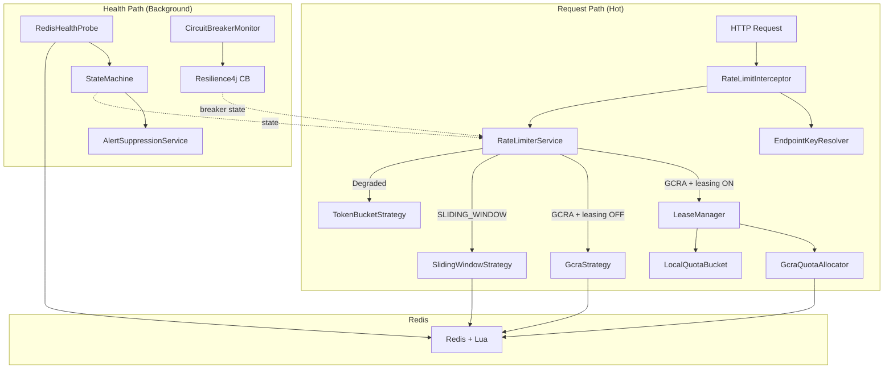

# Architectural Review: Adaptive Rate Limiter

## Honest Assessment & Rating

---

## What's Genuinely Impressive

### 1. The Core Algorithm Design is Excellent
You're not doing a toy rate limiter. The dual-algorithm architecture (Sliding Window for EXACT_QUOTA, GCRA for RATE/PACING) with a clear semantic rationale for WHEN to use each is a design choice that most production rate limiters get wrong. You've documented WHY GCRA's rolling-window count can exceed `limit` (invariant 12), and made that a deliberate, documented architectural decision — not a hidden bug.

### 2. Lua Scripts Are Correct and Atomic
Both `gcra.lua` and `lease_quota.lua` use `redis.call('TIME')` for the clock (no cross-node skew), execute atomically, and handle all edge cases (stale TAT, expired keys, idle-key burst). The lease script correctly operates on the SAME key as the per-request GCRA script — one TAT per key, regardless of path. This is the right design and avoids a common pitfall of having two separate state stores.

### 3. Quota Leasing is Architecturally Sound
The Phase 3 leasing system (`LeaseManager` → `QuotaAllocator` → `LocalQuotaBucket`) is a genuinely advanced pattern. The key invariant — "1 Redis call per K admits instead of 1 per admit" — is correctly implemented and proven by tests. The refund mechanism (unused tokens returned on the next lease) is a detail most implementations skip.

### 4. The EXACT_QUOTA Guard is a Hard Safety Invariant
The `strategy == GCRA` check in `RateLimiterService.checkDistributed()` that prevents payment/sms from ever entering the leased path is correct. This isn't a soft configuration — it's a code-level guard that can't be accidentally bypassed by toggling `leasing.enabled`.

### 5. State Machine Design
HEALTHY → WARNING → DEGRADED → RECOVERY → HEALTHY with hysteresis, stabilization timers, and shared Redis health signals is a mature pattern. The anti-flapping cooldown for forced recovery is a subtle but important detail.

### 6. Test Coverage is Strong
75 tests covering: algorithm invariants, strategy comparison, lease correctness, guard verification, failure modes, concurrency, and end-to-end HTTP integration with Testcontainers. The invariant tests (12 for GCRA alone) are the kind of mathematical-property verification you'd see in distributed systems papers, not typical CRUD app tests.

---

## What Needs Attention (Issues Found)

### 🔴 Critical: `LuaScriptLoader.java` Has 46 Lines of Dead Code

[LuaScriptLoader.java](file:///d:/RATE%20LIMITER%20V2/adaptive-rate-limiter/src/main/java/com/ratelimiter/adaptive_rate_limiter/redis/LuaScriptLoader.java#L1-L46) — Lines 1-46 are the entire OLD version of the class, commented out. The actual class starts at line 48. This is not a small comment — it's the entire previous implementation left as commented-out code. Clean this up. Version control is your history.

### 🔴 `RedisHealthProbe.checkHealth()` Uses `.getConnection()` Unsafely

[RedisHealthProbe.java:59-60](file:///d:/RATE%20LIMITER%20V2/adaptive-rate-limiter/src/main/java/com/ratelimiter/adaptive_rate_limiter/service/health/RedisHealthProbe.java#L59-L60):
```java
String result = redisTemplate.getConnectionFactory()
        .getConnection().ping();
```
`getConnectionFactory()` can return `null`. More importantly, `.getConnection()` opens a connection that is **never closed**. This leaks a Redis connection every 3 seconds (health check interval). Over time, you'll exhaust the Lettuce connection pool. This should use try-with-resources or `RedisTemplate.execute(RedisCallback)`.

### 🟡 `PodDiscoveryService` Is Static — Won't Track HPA Scaling

[PodDiscoveryService](file:///d:/RATE%20LIMITER%20V2/adaptive-rate-limiter/src/main/java/com/ratelimiter/adaptive_rate_limiter/service/PodDiscoveryService.java) reads `POD_COUNT` from environment **once**. If HPA scales from 2 to 10 pods, existing pods still think there are 2. This matters for `FAIL_STRICT` mode which divides limits by pod count. Fix: use the Kubernetes API (fabric8 client) or a shared Redis counter, or at minimum re-read the env var on each call (if it's set by a sidecar/ConfigMap reload).

### 🟡 `Sliding Window` Uses Application Clock, GCRA Uses Redis Clock

[SlidingWindowStrategy.java:29](file:///d:/RATE%20LIMITER%20V2/adaptive-rate-limiter/src/main/java/com/ratelimiter/adaptive_rate_limiter/service/strategy/SlidingWindowStrategy.java#L29) passes `System.currentTimeMillis()` as `ARGV[1]` into the Lua script, while `gcra.lua` uses `redis.call('TIME')` internally. If there's clock skew between app servers (common in K8s — can be seconds), Sliding Window decisions will be inconsistent across pods. GCRA is correct here; Sliding Window should also use Redis' clock.

### 🟡 `AlertSuppressionService` Uses Non-Thread-Safe `ArrayList`

[AlertSuppressionService.java:20](file:///d:/RATE%20LIMITER%20V2/adaptive-rate-limiter/src/main/java/com/ratelimiter/adaptive_rate_limiter/service/state/AlertSuppressionService.java#L20):
```java
private final List<StateTransition> recentTransitions = new ArrayList<>();
```
This is mutated by `onStateTransition()` (called from the health check scheduler thread) and iterated by `countRecentFlaps()` / `cleanupOldTransitions()`. If anything else triggers a state transition concurrently, you'll get a `ConcurrentModificationException`. Use `CopyOnWriteArrayList` or synchronize.

### 🟡 `StateMachine.stateEnteredAt` Is Not Thread-Safe

[StateMachine.java:29](file:///d:/RATE%20LIMITER%20V2/adaptive-rate-limiter/src/main/java/com/ratelimiter/adaptive_rate_limiter/service/state/StateMachine.java#L29): `stateEnteredAt` is a plain `Instant` field, read and written from both `evaluateHealth()` (scheduler thread) and `stableForSeconds()` (same thread, but `evaluateFromWarning`/`evaluateFromDegraded`/`evaluateFromRecovery` are all on the hot path from the interceptor if state transitions happen). Since `currentState` is `AtomicReference` but `stateEnteredAt` isn't, there's a visibility gap — a thread could see the new state but the old `stateEnteredAt`.

### 🟡 `RedisHealthProbe` — `latencyWindow` and `errorWindow` Are Not Thread-Safe

[RedisHealthProbe.java:35-36](file:///d:/RATE%20LIMITER%20V2/adaptive-rate-limiter/src/main/java/com/ratelimiter/adaptive_rate_limiter/service/health/RedisHealthProbe.java#L35-L36): Plain `LinkedList` queues used as sliding windows. Currently only called from the `@Scheduled` method (single thread), so this is safe TODAY, but fragile — any future caller of `checkHealth()` from another thread will cause corruption.

### 🟡 `StateMachine` — `evaluateHealth()` Has a TOCTOU Race

[StateMachine.java:55-74](file:///d:/RATE%20LIMITER%20V2/adaptive-rate-limiter/src/main/java/com/ratelimiter/adaptive_rate_limiter/service/state/StateMachine.java#L54-L75): `currentState.get()` and `currentState.set()` are not atomic together. If two threads call `evaluateHealth()` concurrently (e.g., the scheduler and a degraded-probe from `RateLimiterService.checkDegraded()`), both could read the same old state, evaluate independently, and race to set the new state. Use `compareAndSet` or synchronize.

### 🟢 Minor: `.gitkeep` Files Everywhere

Every package has a `.gitkeep` file. Now that every package has real Java files, these can be cleaned up.

### 🟢 Minor: `StateMachineTest.java` in the Service Directory

[StateMachineTest.java](file:///d:/RATE%20LIMITER%20V2/adaptive-rate-limiter/src/main/java/com/ratelimiter/adaptive_rate_limiter/service/StateMachineTest.java) — 100 bytes, sitting in `src/main` (not `src/test`). This is likely a leftover placeholder.

---

## Architecture Summary



The architecture is clean: the hot path is well-separated from the health/monitoring path, the strategy pattern allows algorithm selection per endpoint, and the leasing system layers cleanly on top of the existing GCRA infrastructure.

---

## Rating: 8.0 / 10

### Breakdown

| Dimension | Score | Notes |
|---|---|---|
| **Architecture & Design** | 9/10 | Multi-algorithm selection, leasing, state machine, circuit breaker — genuinely production-grade patterns. One of the most thoughtful rate limiter designs I've seen in a Spring Boot project. |
| **Algorithm Correctness** | 9/10 | Lua scripts are mathematically sound. GCRA + batch GCRA share the same TAT key. Refund mechanism is correct. The 12 invariant tests are evidence of real understanding, not copy-paste. |
| **Code Quality** | 7/10 | Generally clean, well-documented Javadoc. But: dead code in LuaScriptLoader, connection leak in health probe, thread-safety gaps in StateMachine/AlertSuppression, clock inconsistency between algorithms. |
| **Test Coverage** | 9/10 | 75 tests including invariant proofs, concurrency tests, failure-mode tests, E2E HTTP integration with Testcontainers. Very strong. |
| **Production Readiness** | 6.5/10 | The Redis connection leak is a real operational risk. The clock skew issue in SlidingWindow matters in multi-pod K8s. Pod discovery is static. K8s manifests are incomplete (empty redis-deployment.yaml, hpa.yaml). |
| **Documentation** | 8.5/10 | Excellent inline documentation. The Javadoc on LeaseManager, QuotaAllocator, LocalQuotaBucket, and the Lua scripts reads like a design doc. 7 docs in `/docs` covering architecture, design decisions, and test evidence. |

### What Makes This 8.0 Instead of Higher

The **design** is 9+. What holds it back is **production hardening**: the connection leak, the thread-safety gaps, and the clock inconsistency are the kind of issues that would cause on-call pages in a real deployment. These are all fixable in a day of focused work — they don't reflect design flaws, just incomplete production polish.

### What Makes This 8.0 Instead of Lower

Most Spring Boot projects I see have: a single algorithm (usually a naive fixed window), no state machine, no degradation modes, no circuit breaker integration, no per-endpoint policy, and no test beyond "send 11 requests, expect 429." This project has all of those, PLUS quota leasing with adaptive sizing, PLUS mathematical invariant tests. The ambition and execution are well above average.

---

## Pre-Deployment Priority List

| Priority | Fix | Effort |
|---|---|---|
| **P0** | Fix `RedisHealthProbe` connection leak | 15 min |
| **P0** | Fix `SlidingWindowStrategy` to use Redis clock | 30 min |
| **P1** | Make `StateMachine.evaluateHealth()` thread-safe | 30 min |
| **P1** | Make `AlertSuppressionService.recentTransitions` thread-safe | 10 min |
| **P1** | Create `redis-deployment.yaml` and `hpa.yaml` | 1 hr |
| **P2** | Remove dead code from `LuaScriptLoader.java` | 5 min |
| **P2** | Remove `.gitkeep` files, remove `StateMachineTest.java` from `src/main` | 5 min |
| **P2** | Make `PodDiscoveryService` dynamic | 1 hr |
